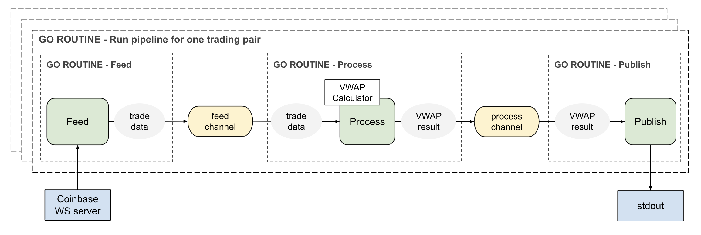

## Description

This application is a real-time VWAP (volume-weighted average price) calculation engine.
It listens to matches data on the Coinbase websocket for the 3 trading pairs BTC-USD, ETH-USD, and ETH-BTC.
It prints out the VWAP values every time it receives a new data point from the websocket.

---

## Usage

- Configuration:
    - The application can be configured by changing the values of the following environment variables:
      ```
      VWAP_TRADING_PAIRS=BTC-USD|ETH-USD|ETH-BTC
      VWAP_WINDOW_SIZE=200
      FEED_NAME=coinbase
      FEED_WS_CONNECTION_URL=wss://ws-feed.exchange.coinbase.com
    - By default, the application is configured with above values according to the requirements.
    - On the dev environment, copy the `.env.example` file into `.env` file in the same directory
      and modify the env values in the `.env` file according to your need.
- Running the application:
    - On local machine: `make run-local`
    - On Docker: `make run-docker`
- Running tests:
    - On local machine: `make test-local`
    - On Docker: `make test-docker`
- Checking test coverage:
    - On local machine: `make coverage-local`
    - On Docker: `make coverage-docker`
- Linting:
    - `make lint`
- Setting up .env file:
    - `make setup-env`

---

## Assumptions

- No authentication is required for the Coinbase websocket connection.
- No persistent storage for streaming data is required.
- Time order is only needed for VWAP results of the same trading-pair.

---

## Design

### Solution

- The solution focuses on efficiency as required.


- Matches data for the 3 trading-pairs are fed concurrently on 3 different websocket connections to Coinbase server
  to help spreading the load and improve efficiency.
  This is also recommended by Coinbase [here](https://docs.cloud.coinbase.com/exchange/docs/websocket-best-practices)
  as quoted below:
  > Spread subscriptions (especially full channel subscriptions) over more than one websocket client connection.
  > For example, do not subscribe to BTC-USD and ETH-USD on the same channel if possible.
  > Instead, open up two separate websocket connections to help load balance those inbound messages across separate
  connections.


- Each trading-pair data feed is processed in a pipeline pattern that utilizes Go routines and channels
  for concurrent processing to make efficient use of I/O and CPUs. The diagram below illustrates the pipeline steps and
  high-level structure:

  
    - The `Feed` step feeds trade data from the matches channel and sends the data through to its output channel.
    - The `Process` step reads from the Feed's output channel above, calculates a VWAP value and sends the result
      to its output channel.
        - This step uses a performant VWAP calculator that utilizes a fixed size slice to store data. The slice is
          only accessed by index ( O(1) ). The calculator saves the previously calculated total values.
          When a new data point is added, it adjusts the total values by subtracting the oldest data point values 
          and adding the new data point values. This way, no looping through all data points is needed 
          when re-calculating VWAP result.
    - The `Publish` step reads from the Process's output channel and prints the VWAP result out the console.


- The `github.com/shopspring/decimal` package is used to ensure floating point precision.

### Code structure

- The code adheres to SOLID principles.
- It is structured in a way that is simple yet extendable, configurable, testable, and maintainable.
  Components that are likely to change in the future can be easily swapped out.
- Dependency injection is done through the SetUp function at the top level packages.

---

## Testing

- The implementation is covered with unit tests at the package level
  and end-to-end tests at the `main` function level.
- While the unit tests employ mocking, the end-to-end tests only mock external third-party services,
  such as Coinbase websocket service, and nothing else in order to make the test code
  as close as possible to the production code.
- Not all scenarios are covered by tests in this assignment due to time constraint.

---

## Room for improvement

- The Dockerfile is not meant for production use.
- There's no rate limit handling. Websocket connections are rate-limited at 8 requests every second per IP and up to 20
  requests for bursts. Messages sent by the client are rate-limited to 100 every second per IP on each connection.
- Logging and error handling can still be improved.
- More input validation should be added.
- The `github.com/shopspring/decimal` package might not be the best package for performance.
- More test scenarios are needed.

---

Thank you for reading and viewing my code! Have a lovely day! :) 